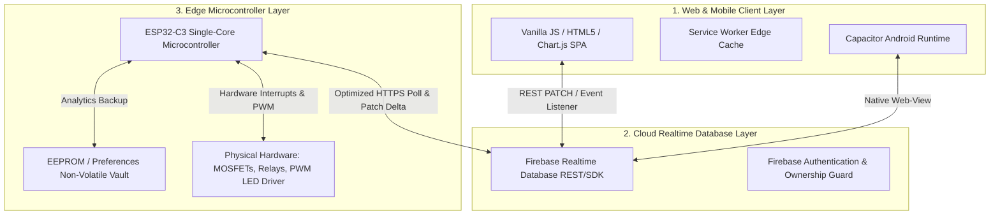
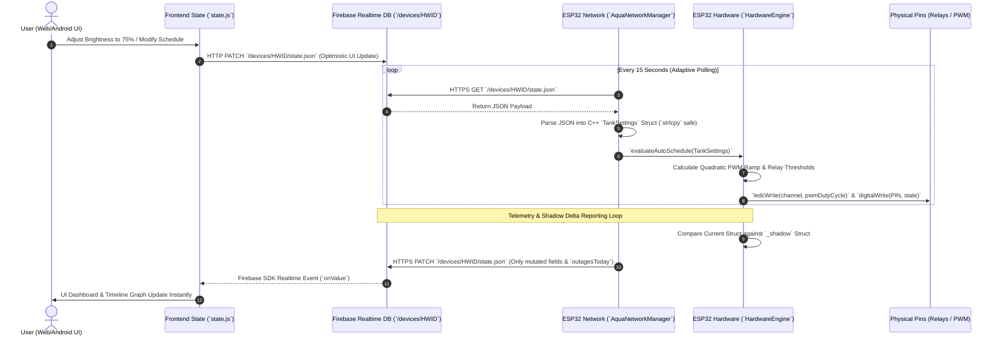

# 🌊 AquaSync: System Architecture & Technical Specifications

**Document Version:** 1.6.0  
**Target Audience:** External Developers, Engineering Managers, Principal Architects, and Stakeholders  
**Classification:** Technical Architecture & Codebase Mapping Baseline  

---

## 1. Executive System Overview

### 1.1 The Real-World Problem & Domain Context
In the specialized domain of high-tech aquascaping and planted aquarium management, biological equilibrium depends on the rigorous, synchronized regulation of three primary environmental variables:
1. **Photosynthetically Active Radiation (PAR) & Photoperiod Dimming:** Aquatic plants require precise lighting intensity and spectral composition (White, Red, Green, Blue) with gradual sunrise and sunset ramping to prevent thermal shock, stress to aquatic life, and opportunistic algae blooms.
2. **Carbon Dioxide ($CO_2$) Injection Scheduling:** $CO_2$ injection must begin prior to the photoperiod to saturate the water column just as photosynthesis commences, and must terminate before light turn-off to prevent nocturnal hypercapnia (carbon dioxide toxicity) and dangerous pH drops when plants shift to respiration.
3. **Thermal Regulation & Evaporative Cooling:** High-output LED lighting and ambient fluctuations require automated, threshold-based or schedule-based evaporative cooling (variable-speed DC/AC fan regulation) to maintain stable water temperatures.

Commercial off-the-shelf smart plugs and Wi-Fi relays are structurally inadequate for this domain. They offer crude binary ($0\%$ / $100\%$) power switching, lack multi-channel PWM dimming capabilities, enforce rigid cloud-dependent timers that fail during network disruptions, and provide no integrated telemetry tracking for load shedding or power outages.

### 1.2 The AquaSync Solution
**AquaSync** is a custom-engineered, production-grade hybrid IoT ecosystem engineered specifically to solve these aquascaping challenges. It delivers full real-time telemetry, automated multi-channel LED color mixing ($W, R, G, B$), smooth quadratic/linear PWM sunrise/sunset dimming, independent $CO_2$ solenoid scheduling, and intelligent fan speed modulation.

### 1.3 The Hybrid Triad Architecture
AquaSync operates on a decoupled **Hybrid Triad Architecture**, bridging three distinct operational layers:



1. **The Client Layer (`/frontend/` & `/mobile/`):** A zero-bundler, pure Vanilla JavaScript single-page application (SPA) wrapped in a progressive web app (PWA) and a native Android Capacitor wrapper. It delivers instant edge-cached UI states via Service Workers (`sw.js`) and renders interactive telemetry graphs using `Chart.js`.
2. **The Cloud State & Brokerage Layer (`Firebase Realtime Database`):** Acts as the asynchronous state broker and single source of truth. It decouples the web client from the physical hardware, allowing remote scheduling, multi-device management, and command queuing without requiring direct port forwarding or dynamic DNS on the local aquarium network.
3. **The Edge Microcontroller Layer (`/firmware/AquaControl/`):** An ESP32-C3 single-core microcontroller running a hardened C++ firmware engine (`Arduino Framework`). It executes real-time hardware control, maintains local non-volatile state backup across power grid failures (`Preferences` vault), and synchronizes with the cloud via a highly compressed HTTPS polling and delta-patching loop.

---

## 2. High-Level System Architecture & Data Flow

### 2.1 End-to-End Data Lifecycle & Synchronization Engine
To ensure deterministic execution across unpredictable Wi-Fi networks and frequent regional power outages (load shedding), AquaSync eliminates fragile persistent socket connections (`ws://` or local port forwarding) in favor of a robust, state-synchronized RESTful architecture.



### 2.2 Client-to-Cloud Command Flow
1. **User Interaction:** When a user modifies a parameter on the web or mobile dashboard (e.g., changing the photoperiod duration or manually overriding the $CO_2$ solenoid via `PrimaryControlCard.js`), the frontend captures the event.
2. **Optimistic Local State Mutation:** `state.js` immediately applies the change to the local in-memory JavaScript state object and triggers a synchronous DOM re-render (`ui-factory.js`) so the user experiences zero interface latency.
3. **Cloud Broker Mutation:** Simultaneously, `state.js` dispatches an asynchronous `HTTP PATCH` (or Firebase SDK update) targeting `https://aqua-fish-controller-default-rtdb.asia-southeast1.firebasedatabase.app/devices/<HWID>/state.json`.

### 2.3 Microcontroller Polling & Hardware Execution
1. **Asynchronous HTTPS Polling:** The ESP32-C3 executes a non-blocking loop managed by `AquaNetworkManager.cpp/.h`. Every $15\text{ seconds}$ (or instantly on boot via a negative timer initialization `_lastFirebasePull = -15000`), the microcontroller initiates an `HTTPS GET` request to retrieve the cloud state payload.
2. **Zero-Copy JSON Parsing & Struct Ingestion:** Using `ArduinoJson`, the incoming payload is parsed without dynamic heap allocation spikes. String fields are safely copied into fixed-size C-character arrays (`char deviceName[32]`, `char startTime[6]`) inside the `TankSettings` struct (`CoreConfig.h`) using memory-safe `strlcpy` bounds checking.
3. **Physical Hardware Evaluation:** The updated struct is passed directly to `HardwareEngine::evaluateAutoSchedule()`.
   - **PWM Lighting Modulation:** If inside the photoperiod, `HardwareEngine` calculates the exact time offset (`evalSecs`) and computes smooth brightness transitions (`sunriseMins`, `sunsetMins`). It maps the percentage (`0-100%`) to 10-bit PWM duty cycles (`0-1023`) across individual color channels ($W, R, G, B$) via `ledcWrite()`.
   - **Solenoid & Fan Relays:** Evaluates independent start/end timestamps (`co2OnTime`, `co2OffTime`, `fanOnTime`, `fanOffTime`) and drives GPIO pins connected to opto-isolated MOSFETs or mechanical relays via `digitalWrite(PIN_CO2, HIGH/LOW)`.

### 2.4 Backward Telemetry & Outage Analytics Flow
1. **Minute-by-Minute Analytics Tracking:** While running, `HardwareEngine` tracks exact active lighting minutes (`activeMinutesToday[24]`) and total microcontroller awake uptime (`awakeMinutesToday[24]`) sliced into 24 hourly buckets.
2. **Power Outage & Load Shedding Detection:** Upon boot, `HardwareEngine` checks non-volatile flash storage (`Preferences`). If a grid outage occurred, it logs the downtime duration (`lightLostHistory[30]`) and appends an exact timestamp string (`"HH:MM-HH:MM"`) to `outageEventsToday[256]`.
3. **Shadow Delta Syncing:** Rather than pushing full telemetry payloads continuously, `AquaNetworkManager::generateDeltaStateJson()` compares every field of the active `TankSettings` struct against an in-memory `TankSettings _shadow` struct. Only modified fields are serialized into a minimal patch payload and pushed to Firebase via `HTTPS PATCH`.
4. **Real-Time UI Reflection:** The Firebase JS SDK on the web client receives the delta update via open server-sent events (`onValue`) and refreshes `Charts.js` hourly timelines and system indicators instantly.

---

## 3. Deep-Dive: Engineering & Optimization Triumphs

### 3.1 API & Bandwidth Optimization: The ~27MB / 24-Hour Footprint
A primary engineering challenge in IoT aquascaping is cellular/remote data consumption and microcontroller network overhead. Polling and updating a cloud database every $15\text{ seconds}$ normally generates massive HTTP header and JSON overhead, easily exceeding $300\text{ MB/month}$.

**The Solution: Shadow State Delta Patching (`AquaNetworkManager.h`)**
We engineered an aggressive payload compression architecture that restricts the entire ecosystem's network footprint to approximately **$\sim27\text{ MB per 24 hours}$** (`< 1.1 MB/day` active telemetry + sync overhead):

```cpp
// AquaNetworkManager.h - Shadow Delta Sync Architecture
String generateDeltaStateJson() {
    JsonDocument doc;
    TankSettings& s = _settingsMgr.get();
    int changes = 0;

    // Only serialize fields whose current state differs from the stored _shadow
    if (!_shadowInit || s.isAutoMode != _shadow.isAutoMode) { 
        doc["isAutoMode"] = s.isAutoMode; 
        _shadow.isAutoMode = s.isAutoMode; 
        changes++; 
    }
    if (!_shadowInit || s.currentBrightness != _shadow.currentBrightness) { 
        doc["currentBrightness"] = s.currentBrightness; 
        _shadow.currentBrightness = s.currentBrightness; 
        changes++; 
    }
    
    // Check 24-hour activity arrays element-by-element
    for(int i = 0; i < 24; i++) {
        if (!_shadowInit || s.activeMinutesToday[i] != _shadow.activeMinutesToday[i]) {
            doc["hourlyData/" + String(i)] = s.activeMinutesToday[i];
            _shadow.activeMinutesToday[i] = s.activeMinutesToday[i];
            changes++;
        }
    }
    // ... continues for all telemetry fields
```

- **Elimination of Redundant Transmissions:** If hardware parameters remain static (e.g., mid-day steady-state lighting), `changes == 0` and the delta patch is completely suppressed or reduced to a micro-heartbeat (`< 150 bytes`).
- **Path-Based Realtime DB Updates:** Instead of uploading entire 24-hour or 30-day arrays (`activeMinutesHistory[30]`), our JSON engine utilizes Firebase path-flattening (`doc["hourlyData/" + String(i)] = value`). This allows updating a single integer at `hourlyData/14` without re-transmitting the remaining 23 array slots.

### 3.2 Hardware-Software Payload Bridging: Safe C++ Memory Engineering
The ESP32-C3 has strict SRAM limitations ($\sim400\text{ KB}$ available RAM). Processing complex, deeply nested JSON strings from the web application often leads to heap fragmentation, string reallocation failures, and fatal stack overflows when combined with heavy SSL/TLS encryption handshakes (`WiFiClientSecure`).

**1. Single-Core Blocking Execution Model (`DO NOT use FreeRTOS xTaskCreate`)**
As mandated in `GEMINI.md`, we intentionally rejected multi-threaded `FreeRTOS xTaskCreate` separation for network operations. On single-core microcontrollers like the ESP32-C3, spawning concurrent FreeRTOS tasks while executing MbedTLS/SSL cryptographic handshakes causes severe thread starvation, stack overflows, and watchdog timer (`WDT`) resets during weak Wi-Fi signal conditions (`RSSI < -80 dBm`). All network polling and hardware evaluation strictly execute within a disciplined, single-core blocking state machine in `loop()`.

**2. Fixed-Size Struct Mapping & `strlcpy` Bounds Enforcement**
We eliminated all `std::string` and Arduino `String` dynamic heap allocations inside critical data-handling paths (`SettingsManager.h` and `CoreConfig.h`). All parameters map directly to pre-allocated C-struct buffers:

```cpp
// CoreConfig.h - Fixed-size memory layout
struct TankSettings {
    char deviceName[32];            // Strict 32-byte limit
    char startTime[6];              // "HH:MM\0" 6-byte buffer
    char co2OnTime[6];
    char co2OffTime[6];
    uint16_t activeMinutesToday[24]; // Exactly 48 bytes RAM
    uint16_t activeMinutesHistory[30];// Exactly 60 bytes RAM
    char outageEventsToday[256];     // Fixed log buffer
};

// SettingsManager.h - Memory-safe string ingestion
if (doc.containsKey("deviceName")) { 
    // Replaced dangerous strncpy/String.c_str() with strlcpy to guarantee null-termination without buffer overflow
    strlcpy(_settings.deviceName, doc["deviceName"], sizeof(_settings.deviceName)); 
}
```

**3. Non-Volatile Flash Vault (`Preferences.h`)**
To survive daily load shedding without losing critical analytics or tracking state, `SettingsManager` and `HardwareEngine` utilize the ESP32's Non-Volatile Storage (NVS) flash partition:
- **`_prefs.begin("aqua-ctrl", false)`:** Opens the flash vault safely (`false` allows write-initialization on fresh chips).
- **Binary Array Dump:** Instead of serializing history arrays into JSON strings before writing to flash, we execute raw binary dumps (`_prefs.putBytes("actHist", settings.activeMinutesHistory, sizeof(settings.activeMinutesHistory))`), achieving microsecond save times and zero heap churn.

### 3.3 Performance & Edge-Caching: Instant UI Loading States
To deliver a premium, native-app feel across mobile browsers and our Android APK (`/mobile/apk/`), the Vanilla JavaScript frontend eliminates network round-trip blocking on launch.

1. **Service Worker Pre-Caching (`sw.js`):** Intercepts network requests and caches core static assets (`Index.html`, all `/src/components/*.js` modules, and `/assets/*.png`). On application startup, the UI renders instantly ($0\text{ ms}$ layout load time) directly from cache before initiating any remote network connections.
2. **Local Storage State Shadowing (`state.js`):** Every time `state.js` pulls or patches data from Firebase, it writes a compressed snapshot of the entire `devices` tree to browser `localStorage`. When the user re-opens the app, the dashboard hydrates immediately using the last-known state (`_hydrateFromStorage()`), displaying accurate slider positions and schedules while the background sync establishes an SSL connection to Firebase.

### 3.4 Security & Device Ownership Architecture
To prevent unauthorized third-party access and cross-control of hardware devices:
1. **Firebase Authentication & Email-Locked UIDs:** Users authenticate via the official Firebase JS SDK (`AuthModal.js` / `Account.js`). Each user is assigned a unique `UID`.
2. **Hard-Linked Hardware Ownership (`ownerUid`):** When a new ESP32 microcontroller is claimed via `PairingWizard.js`, the web application writes the user's `UID` into the device's root directory (`/devices/<HWID>/ownerUid`).
3. **Database Security Rules & Complete Cloud Scrubbing:** Firebase Realtime Database rules enforce that only requests matching `auth.uid == data.child('ownerUid').val()` can read or write commands. Furthermore, when a user initiates a **Factory Reset** (`state.unclaimDevice()`), our frontend explicitly sends `DELETE` commands across all three branches (`state`, `commands`, and `ownerUid`), completely scrubbing and eradicating the `AQUA-****` root object from the Firebase cloud directory.

---

## 4. Architectural Directory & Codebase Mapping

Following our DevOps restructuring (`v1.6.0`), the repository is organized into a clean, domain-driven tree separating Frontend, Firmware, and Mobile engineering domains:

```
AquaSync (Repo Root)
├── frontend/                     # Core Web & Client Application Domain
│   ├── Index.html                # Single-page application entry point & layout container
│   ├── manifest.json             # PWA web manifest defining standalone display & branding
│   ├── sw.js                     # Service Worker: pre-caches modules & handles offline mode
│   ├── assets/                   # Static branding graphics (`aqua-fish-logo.png`, `icon.png`)
│   ├── www/                      # Capacitor build output synchronization directory
│   └── src/                      # Vanilla JS Architecture Layer
│       ├── main.js               # Application initializer, event router & firmware update checker
│       ├── state.js              # Central State Store: manages Firebase sync, localStorage & unclaim
│       ├── api.js                # Network wrapper: handles REST fetch, retries & manifest verification
│       ├── ui-factory.js         # DOM Controller: mounts components & coordinates view transitions
│       ├── firebase-config.js    # Firebase SDK initialization & project credentials
│       ├── utils.js              # Helper utilities: time formatting, math & UI debouncing
│       ├── components/           # Modular UI Renderers
│       │   ├── analytics/        # `Charts.js` (hourly/daily graphs) & `Overview.js` (summary cards)
│       │   ├── hardware/         # `Dimmer.js`, `ColorMixer.js`, `Relay.js`, `ScheduleCard.js`, `OverrideGrid.js`
│       │   └── system/           # `Firmware.js` (OTA UI), `AuthModal.js`, `PairingWizard.js`, `Maintenance.js`
│
├── firmware/                     # Microcontroller & Hardware Engineering Domain
│   ├── AS-Standard_v1.5.1.bin    # Staged compiled OTA binary release (pulled via GitHub raw URL)
│   └── AquaControl/              # ESP32 C++ Source Code (`Arduino Framework`)
│       ├── AquaControl.ino       # Main firmware loop (`loop()`), setup & serial initialization
│       ├── AquaNetworkManager.h  # Firebase REST polling, JSON delta generation & OTA update handler
│       ├── ButtonManager.h       # Hardware push-button interrupt debounce & manual override triggers
│       ├── CoreConfig.h          # Global constants, pinout definitions & `TankSettings` struct
│       ├── HardwareEngine.h      # Core logic: PWM dimming calculations, relay control & NVS flash vault
│       ├── SettingsManager.h     # Preferences wrapper: loads/saves configuration & parses JSON safely
│       └── debug_helpers.h       # Diagnostic hooks: monitors Heap RAM, CPU Temp & Wi-Fi RSSI safely
│
├── mobile/                       # Native Mobile Application Domain
│   ├── android/                  # Full Android Studio project (`app/`, Gradle scripts, `AndroidManifest.xml`)
│   └── apk/                      # Production compiled binaries (`AquaSync-v1.5.0.apk`)
│
├── netlify.toml                  # Netlify CI/CD build configuration (`publish = "frontend"`)
├── capacitor.config.json         # Capacitor mobile config mapping `webDir` (`frontend`) to `android.path`
├── firmware.json                 # Root OTA manifest file checked by live web app & microcontrollers
├── package.json / node_modules   # Node dependencies (`@capacitor/cli`, `@capacitor/android`)
└── README.md / GEMINI.md         # Documentation baseline & AI agent architectural rules
```

### Key Component Responsibilities & Module Deep-Dive

#### 1. Frontend Core (`/frontend/src/`)
- **`state.js` (`StateManager`):** The beating heart of the client. It maintains `this.devices` in memory, establishes `onValue` real-time listeners via the Firebase JS SDK, calculates live recovery/sun-transition countdowns, and exposes atomic methods (`updateDeviceState()`, `unclaimDevice()`) to UI components.
- **`ui-factory.js`:** Eliminates the need for virtual DOM frameworks (like React or Vue) by utilizing direct, surgical DOM mounting. It reads state snapshots and triggers targeted component re-render functions only when relevant data branches change.
- **`Charts.js`:** Dynamically constructs minute-by-minute active timeline visualizations. It calculates exact start/end time offsets and distributes active lighting duration accurately across hourly X-axis blocks without rounding distortion.

#### 2. Firmware Core (`/firmware/AquaControl/`)
- **`AquaControl.ino`:** Employs a single-core, non-blocking orchestration loop (`loop()`). It sequentially executes `_hwEngine.update()` (hardware muscle ticks every $50\text{ ms}$), `_btnMgr.update()` (button polling), and `_netMgr.update()` (adaptive Firebase network syncing).
- **`HardwareEngine.h`:** Manages the mathematical transition curves for lighting. Instead of stepping abruptly, it computes linear/quadratic ramps across `sunriseMins` and `sunsetMins`, applying real-time load shedding recovery (`recoveryMins`) if power was lost mid-schedule. It writes directly to hardware pins (`PIN_RELAY = 2`, `PIN_FAN = 3`, `PIN_LIGHT = 5`, `PIN_CO2 = 10`).
- **`AquaNetworkManager.h`:** Implements `HTTPClient` and `WiFiClientSecure` over MbedTLS. It manages the `_shadow` state comparison engine, parses HTTP responses safely, and handles Over-The-Air (`HTTPUpdate`) binary downloads directly from our GitHub raw releases (`/firmware/AS-Standard_v*.bin`) when commanded by `Firmware.js`.

---

## 5. Developer Onboarding & Contribution Guide

This section provides the exact technical workflow for onboarding engineers to configure local environments, link custom Firebase instances, compile the ESP32 firmware, and execute safe end-to-end testing.

### 5.1 Local Development Environment Setup
1. **Clone & Install Dependencies:**
   ```bash
   git clone https://github.com/nafishfuad/AquaSync.git
   cd AquaSync
   npm install
   ```
2. **Local Web Server Launch:**
   Because AquaSync uses ES6 module imports (`<script type="module">`), you cannot open `Index.html` directly via `file://`. Launch a local development server targeting the `/frontend/` directory:
   ```bash
   npx serve frontend -p 3000
   # OR using Python:
   cd frontend && python -m http.server 3000
   ```
3. **Capacitor Mobile Sync (Android APK Development):**
   If modifying frontend code for the Android application, sync web assets to the Android Studio project:
   ```bash
   npx cap copy android
   npx cap sync android
   ```
   Open `/mobile/android/` inside **Android Studio** to build and generate new `.apk` artifacts inside `/mobile/apk/`.

### 5.2 Linking a Custom Firebase Project
To isolate testing from the live production database:
1. Create a new Firebase project at [console.firebase.google.com](https://console.firebase.google.com) and enable **Authentication** (Email/Password) and **Realtime Database**.
2. **Update Frontend Credentials:** Open `/frontend/src/firebase-config.js` and replace the `firebaseConfig` object with your project credentials:
   ```javascript
   export const firebaseConfig = {
       apiKey: "AIzaSy...",
       authDomain: "your-dev-project.firebaseapp.com",
       databaseURL: "https://your-dev-project-default-rtdb.firebaseio.com",
       projectId: "your-dev-project",
       storageBucket: "your-dev-project.appspot.com",
       messagingSenderId: "...",
       appId: "..."
   };
   ```
3. **Update Firmware Credentials:** Open `/firmware/AquaControl/CoreConfig.h` and update the database URL:
   ```cpp
   const String FIREBASE_URL = "https://your-dev-project-default-rtdb.firebaseio.com";
   ```

### 5.3 ESP32 Firmware Compilation & Flashing Workflow
1. **IDE Setup:** Install [VS Code](https://code.visualstudio.com/) with the **PlatformIO** or **Arduino IDE** extension, configured for the `ESP32-C3 Dev Module` (`esp32c3` architecture).
2. **Required C++ Libraries:** Ensure the following libraries are installed in your environment:
   - `ArduinoJson` (v6.x or v7.x)
   - `Preferences` (Built-in ESP32 core)
   - `HTTPUpdate` & `WiFiClientSecure` (Built-in ESP32 core)
3. **Flashing the Hardware:**
   Connect the ESP32-C3 via USB-C. In Arduino IDE / PlatformIO, select your COM port and execute **Upload**. Open the Serial Monitor (`115200 baud`) to verify Wi-Fi association and memory heap initialization:
   ```text
   [SYS] 🚀 Booting AquaSync Controller v1.5.5...
   [WIFI] Connected! IP: 192.168.1.50 | RSSI: -54 dBm
   [NET] Initialized Firebase REST synchronization loop.
   [SYS] 💾 Analytics securely backed up to Flash Vault.
   ```

### 5.4 Safe End-to-End Testing Protocols
Before committing code, verify system integrity against our core baseline rules (`GEMINI.md`):
- **Memory Leak Verification:** Monitor the Serial output during active `PATCH` cycles using `debug_helpers.h`. Ensure `ESP.getFreeHeap()` does not degrade continuously after multiple network syncs.
- **Zero-Blocking Network Check:** While the ESP32 is communicating with Firebase, trigger the physical push-button (`PIN_BTN = 9`). The manual override must respond within $<100\text{ ms}$ without being blocked by HTTPS cryptographic handshakes.
- **Netlify & OTA Backwards Compatibility:** Never move or rename `firmware.json` (root) or binaries inside `/firmware/*.bin` without updating both `AquaNetworkManager.h` (`fullDownloadUrl`) and `api.js` (`checkLatestFirmware`). Deployed hardware relies strictly on these static GitHub raw paths for remote updates.

---
*End of Architectural Specification Baseline.*
